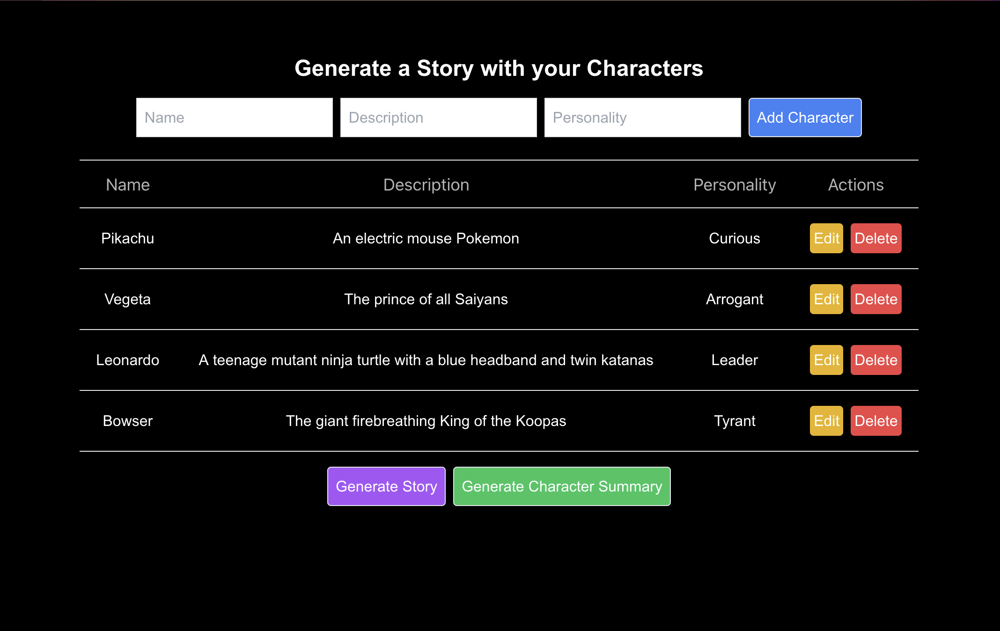

### Make Your Own Characters & Story Generator ###



## About The Project
This is a student project for Encode academy, building a story telling generator using Next.js, Shadcn, OpenAI API and Vercel. The purpose of the project is to generate a story with the characters that the user has created. The user can add, edit and delete characters. Once the user clicks on the generate story button, the app will generate a story with the characters that the user has created utilizing the OpenAI API. Finally, the user can generate a summary of the character's role in the story after the story has been generated.


### Built With
- TypeScript
- Next.js
- Shadcn
- OpenAI API

## Getting Started
1. Create an account at OpenAI
2. Create an API Key at [https://platform.openai.com/api-keys](https://example.com)
3. Clone the repo
   ```
   git clone https://github.com/AAlcazar5/encode-joke-telling-app
   ```
4. Install NPM packages
   ```
   npm install openai
   npm install ai
   ```
5. Create a .env and add your API
   ```
   OPENAI_API_KEY = 'ENTER YOUR API'
   ```
6. Open the terminal and run the project with 
   ```
   npm run dev
   ```
7. Interact with the app in the browser at [http://localhost:3000](http://localhost:3000)

## Utilizing a Local API

If you would like to use a local API, you can do so by replacing the OpenAI API call in the app/api/chat/route.ts file. 

```
const openai = new OpenAI();
```
with the following:

```
const openai = new OpenAI({
  baseURL: "http://127.0.0.1:5000/v1",
});
```

Follow the instructions to run the Text Generation Web UI API locally: 

    - Clone or download the repository https://github.com/oobabooga/text-generation-webui.
    - Ensure to change directory into the repository in your terminal.
    -Run the script that matches your OS in the terminal: start_linux.sh, start_windows.bat, start_macos.sh, or start_wsl.bat and ensure to append the --api flag to the command.
    - Select your GPU vendor when asked.
    - Once the installation ends, browse to http://localhost:7860.
    - Navigate to https://huggingface.co/models in your browser and pick a model of your choice.
    - Head to models tab at http://localhost:7860, copy and paste the link of the model from Hugging Face in the Download model or LoRA section. 
        - If you are using a GGUF model, you also need to add the file name, get the file list and pick a model before downloading.
    - Pick the your new model under the Model section (you may need to click the refresh model button), click on the Load model button to load the model into the API.
    - Congratulations! You've successfully set up your local API and can now generate stories with your own custom models.


